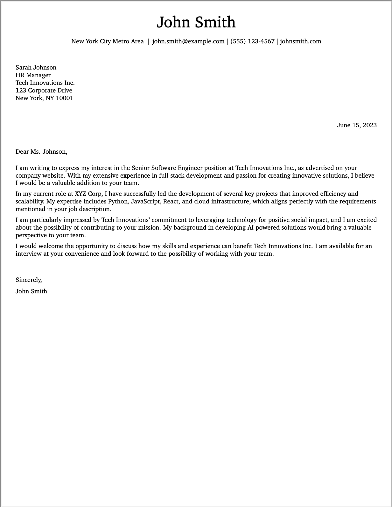

# Classic Cover Letter Template

This template is a classic cover letter template that is designed to be a simple and clean cover letter template.

## Template Structure

The template is structured in the following way:

- `classic.tex`: The main LaTeX file that contains the template.
- `helper.py`: The helper file that contains the helper functions for the template.
- `README.md`: The README file for the template.
- `preview.png`: The preview image for the template.

## Preview



## Usage 

- You can use the template by running the following command:

```bash
python -m resume_agent_template_engine.cli generate cover_letter classic data.yaml output.pdf
```

## Data Schema

- `personalInfo`: The personal information of the candidate.
    - `name`: The name of the candidate.
    - `email`: The email of the candidate.
    - `phone`: The phone of the candidate.
    - `location`: The location of the candidate.
    - optional:
        - `website`: The website of the candidate.
        - `website_display`: The display name of the candidate's website.
        - `linkedin`: The linkedin of the candidate.
        - `linkedin_display`: The display name of the candidate's linkedin.
        - `github`: The github of the candidate.
        - `github_display`: The display name of the candidate's github.
        - `twitter`: The twitter of the candidate.
        - `twitter_display`: The display name of the candidate's twitter.
        - `x`: The x of the candidate.
        - `x_display`: The display name of the candidate's x.
- `coverLetter`: The cover letter information of the candidate.
    - `recipient`: The recipient of the cover letter.
        - `name`: The name of the recipient.
        - `title`: The title of the recipient.
        - `company`: The company of the recipient.
        - `address`: The address of the recipient.
            - `street`: The street of the recipient.
            - `city`: The city of the recipient.
            - `state`: The state of the recipient.
            - `zip`: The zip of the recipient.
            - `country`: The country of the recipient.
    - `date`: The date of the cover letter.
    - `salutation`: The salutation of the cover letter.
    - `body_content`: The body content of the cover letter.
    - `closing`: The closing of the cover letter.
    - `signature`: The signature of the cover letter.
    - `signature_name`: The name of the signature.
    - `signature_title`: The title of the signature.
    - `signature_company`: The company of the signature.

