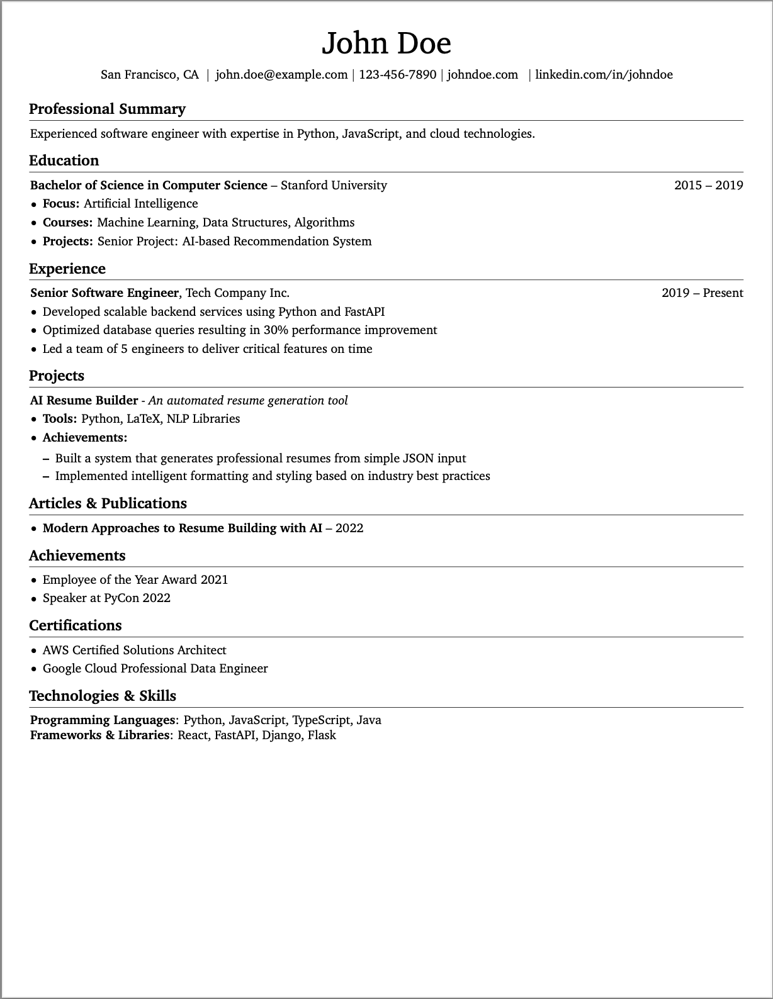

## Classic Resume Template

This template is a classic resume template that is designed to be a simple and clean resume template.

## Template Structure

The template is structured in the following way:

- `classic.tex`: The main LaTeX file that contains the template.
- `helper.py`: The helper file that contains the helper functions for the template.
- `README.md`: The README file for the template.
- `preview.png`: The preview image for the template.

## Preview



## Usage 

- You can use the template by running the following command:

```bash
python -m resume_agent_template_engine.cli generate resume classic data.yaml output.pdf
```

### Data Schema

- `personalInfo`: The personal information of the candidate.
    - `name`: The name of the candidate.
    - `email`: The email of the candidate.
    - `phone`: The phone of the candidate.
    - `location`: The location of the candidate.
    - `website`: The website of the candidate.
    - `linkedin`: The linkedin of the candidate.
    - `website_display`: The display name of the candidate's website.
    - `linkedin_display`: The display name of the candidate's linkedin.
    - `github`: The github of the candidate.
- `professionalSummary`: The professional summary of the candidate.
    - `summary`: The summary of the professional summary.
- `experience`: The experience of the candidate.
    - `title`: The title of the experience.
    - `company`: The company of the experience.
    - `location`: The location of the experience.
    - `startDate`: The start date of the experience.
    - `endDate`: The end date of the experience.
    - `details`: The details of the experience.
- `education`: The education of the candidate.
    - `degree`: The degree of the education.
    - `institution`: The institution of the education.
    - `startDate`: The start date of the education.
    - `endDate`: The end date of the education.
    - `focus`: The focus of the education.
    - `notableCourseWorks`: The notable course works of the education.
    - `projects`: The projects of the education.
- `projects`: The projects of the candidate.
    - `name`: The name of the project.
    - `description`: The description of the project.
    - `tools`: The tools of the project.
    - `achievements`: The achievements of the project.
- `articlesAndPublications`: The articles and publications of the candidate.
    - `title`: The title of the article or publication.
    - `date`: The date of the article or publication.
- `achievements`: The achievements of the candidate.
- `skills`: The skills of the candidate.
    - `category`: The category of the skill.
    - `skills`: The skills of the category.
- `certifications`: The certifications of the candidate.
    - `name`: The name of the certification.
    - `issuer`: The issuer of the certification.
    - `date`: The date of the certification.
    - `expirationDate`: The expiration date of the certification.